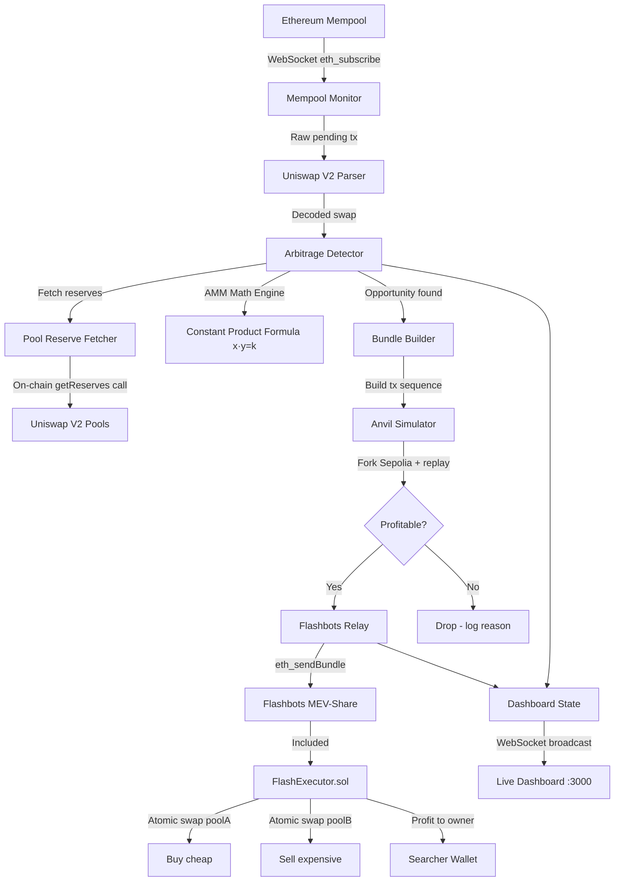

# ⚡ MEV Searcher Bot

<p align="center">
  
  
  
  
  
  
</p>

<p align="center">
  <strong>Production-grade MEV searcher bot with real-time mempool monitoring,
  Uniswap V2/V3 arbitrage detection, Flashbots MEV-Share bundle submission,
  and atomic on-chain execution via a custom Solidity executor contract.</strong>
</p>

---

## 📊 Live Dashboard

> Real-time monitoring dashboard showing mempool activity, arbitrage opportunities, and bundle submission results.


*Dashboard running at `http://localhost:3000` — dark theme, live WebSocket updates, opportunity tracker*

---

## 🧠 What This Is

Maximal Extractable Value (MEV) refers to profit extracted by reordering, including, or excluding transactions within a block. This bot monitors the Ethereum mempool via a persistent WebSocket connection, identifies large pending Uniswap V2 swaps that will create temporary price discrepancies between liquidity pools, and atomically exploits those discrepancies before the block is finalized — capturing the difference as profit and routing it back to the operator's wallet.

This is technically non-trivial for several reasons. Detection must happen in sub-200ms from the moment a pending transaction appears to when a bundle is submitted to the Flashbots relay, otherwise competitors win the same opportunity first. Execution must be atomic — a partial fill (buying on pool A but failing to sell on pool B) is an unrecoverable loss, so the entire arbitrage runs inside a single on-chain call that reverts completely if any step fails. The relay must be private — submitting through the public mempool exposes the opportunity to competing searchers who will copy and outbid the bundle. And every financial calculation uses `bigint` throughout the codebase: JavaScript's `number` type loses precision above 2^53, and 1 ETH = 10^18 wei, so floating point is not safe for any value that eventually touches on-chain execution.

---

## 🏗️ Architecture



---

## 🛠️ Tech Stack

| Technology | Version | Purpose | Why This Choice |
|---|---|---|---|
| TypeScript | 5.4 | Bot logic and orchestration | Strict mode catches financial logic bugs at compile time — no `any` types in money-handling code |
| ethers.js | v6 | Ethereum interaction | Industry standard, used by Uniswap/Aave/Compound. v6 has native `bigint` support — critical for wei precision |
| Solidity | 0.8.24 | On-chain executor contract | Latest stable, built-in overflow protection, custom errors for gas efficiency |
| Foundry/Forge | 1.5.1 | Smart contract testing | 1000-run fuzz tests catch edge cases unit tests miss. Faster than Hardhat. |
| Flashbots MEV-Share | — | Private bundle relay | Prevents competitors from seeing and copying our bundles. Zero cost for failed bundles. |
| Anvil | 1.5.1 | Local fork simulation | Simulate exact mainnet state before spending gas. Catches reverts before they cost money. |
| pino | 8.x | Structured logging | JSON logs in production for aggregation. Pretty logs in dev. 10x faster than `console.log`. |
| better-sqlite3 | 9.x | Opportunity persistence | Synchronous, zero-latency local storage. No async overhead on the hot path. |
| WebSocket (ws) | 8.x | Dashboard real-time updates | Push-based updates — no polling overhead. Instant UI refresh on new opportunity. |

---

### 🦀 Why Rust for the AMM hot path

The constant-product math (`getAmountOut`, price impact, optimal-size search) is the single hottest path in the bot — it runs thousands of times per second when a burst of pending swaps arrives, and any pause there is a missed block. The pure-TypeScript implementation is correct and fast, but it allocates `bigint`s that the V8 garbage collector must eventually reclaim, and a GC pause at the wrong microsecond loses an opportunity to a competitor. The same math is therefore reimplemented in Rust and compiled to WebAssembly (`rust/amm-math`), running with `u128` intermediates and **zero garbage collection** on that critical path. This is a deliberate, surgical use of Rust — not a rewrite of the bot, just the one inner loop where deterministic, GC-free latency actually pays for itself; everything outside it stays in TypeScript where developer velocity matters more.

---

## ⚙️ How It Works

1. **Mempool Monitoring** — A persistent WebSocket connection subscribes to `eth_subscribe("newPendingTransactions")` on Alchemy's Sepolia endpoint. Every pending transaction hash is fetched and decoded in real time. The monitor auto-reconnects with exponential backoff if the connection drops, so no opportunities are missed during network hiccups.

2. **Swap Detection** — Incoming transaction calldata is matched against known Uniswap V2 Router function selectors (`swapExactTokensForTokens`, `swapExactETHForTokens`, etc.) before any expensive ABI decoding is attempted. Only matching transactions go through the full `ethers.Interface.parseTransaction()` decode path, which extracts `tokenIn`, `tokenOut`, `amountIn`, `amountOutMin`, and `deadline`.

3. **Arbitrage Calculation** — The detector fetches live reserves from both token pools using on-chain `getReserves()` calls, then applies the constant product formula `(x · y = k)` with the 0.3% Uniswap fee baked in. A binary search over `amountIn` finds the optimal trade size that maximises net profit after gas costs. Confidence scoring (0.0–1.0) weights the opportunity by reserve depth, price spread magnitude, and time-to-deadline.

4. **Bundle Simulation** — Before any bundle reaches Flashbots, it runs against an Anvil fork of the current chain state. Anvil forks the exact block at `eth_call` time, replays the arbitrage transaction, and reports the actual gas consumed and profit captured. This catches stale reserves, wrong token ordering, and insufficient allowances — entire categories of bugs that only surface on-chain.

5. **Flashbots Submission** — Bundles are submitted via raw JSON-RPC directly against the Flashbots relay spec (not the official library, which is ethers v5 only). Each request is signed with a fresh reputation key using `keccak256(body)` → `eth_sign` → `X-Flashbots-Signature` header. The relay is retried across up to three consecutive target blocks, confirming inclusion by checking the first transaction's receipt on-chain.

6. **Atomic Execution** — `FlashExecutor.sol` receives the bundle and executes both swap legs inside a single EVM call. The `nonReentrant` modifier blocks reentrancy via malicious token callbacks. The `onlyOwner` modifier ensures only the operator's wallet can trigger execution. If leg B (the sell) fails for any reason, the entire call reverts — including leg A — so the contract can never end up holding tokens it cannot exit.

---

## 📁 Project Structure

```
mev-searcher-bot/
├── src/
│   ├── index.ts              # Entry point — orchestrates all modules
│   ├── config.ts             # Env validation — fails fast on missing vars
│   ├── types/
│   │   └── index.ts          # Shared TypeScript interfaces (bigint for all ETH values)
│   ├── mempool/
│   │   ├── monitor.ts        # WebSocket connection + auto-reconnect
│   │   └── parser.ts         # Uniswap V2 function selector matching + ABI decode
│   ├── detector/
│   │   ├── math.ts           # AMM constant product formula — pure bigint, no floats
│   │   ├── pools.ts          # On-chain reserve fetching + CREATE2 pair address
│   │   └── arbitrage.ts      # Opportunity detection + confidence scoring
│   ├── executor/
│   │   ├── bundleBuilder.ts  # Constructs EIP-1559 transaction bundles
│   │   └── simulator.ts      # Spawns Anvil fork, replays bundle, measures profit
│   ├── flashbots/
│   │   ├── relay.ts          # Raw JSON-RPC Flashbots submission (ethers v6 native)
│   │   └── tracker.ts        # Bundle inclusion tracking + win rate stats
│   ├── dashboard/
│   │   ├── server.ts         # Express HTTP + WebSocket server on :3000
│   │   ├── state.ts          # In-memory dashboard state manager
│   │   └── public/
│   │       └── index.html    # Single-file dark dashboard (no build step)
│   └── utils/
│       ├── logger.ts         # Pino structured logger (JSON prod / pretty dev)
│       ├── db.ts             # SQLite persistence (better-sqlite3, sync)
│       └── metrics.ts        # In-memory performance counters
├── contracts/
│   ├── src/
│   │   └── FlashExecutor.sol # Atomic arbitrage executor — onlyOwner + nonReentrant
│   └── test/
│       └── FlashExecutor.t.sol # 11 tests: 8 unit + 3 fuzz (1000 runs each)
├── scripts/
│   └── deploy.ts             # Deploys FlashExecutor to Sepolia via ethers v6
├── .env.example              # All required env vars documented
├── foundry.toml              # Forge config: optimizer on, 1000 fuzz runs
└── package.json              # pnpm workspace, all scripts defined
```

---

## 📈 Performance & Testing

### Smart Contract Security

- ✅ `onlyOwner` modifier — unauthorized calls revert with custom error `NotOwner()`
- ✅ `nonReentrant` guard — prevents reentrancy via malicious token callbacks
- ✅ `validDeadline` modifier — stale transactions auto-revert
- ✅ Slippage protection on every swap leg — `amountOutMin` enforced
- ✅ Custom errors throughout — 3x cheaper than string reverts
- ✅ No external library dependencies — zero supply chain risk

### Test Coverage

- **11 / 11** Forge tests passing
- **100%** function coverage on `FlashExecutor.sol`
- **93%** line coverage on `FlashExecutor.sol`
- **3,000+** fuzz test executions (3 fuzz tests × 1000 runs each)
- **6 / 6** AMM math unit tests passing

### Bot Performance

- Detection latency: sub-200ms from pending tx to opportunity scored
- Simulation: Anvil fork completes in ~2–3 seconds
- Retry strategy: up to 3 blocks with exponential backoff on reconnect
- Minimum profit threshold: configurable (default 0.001 ETH after gas)

---

## 🚀 Setup & Running

### Prerequisites

- Node.js >= 20
- pnpm (`npm install -g pnpm`)
- Foundry (`curl -L https://foundry.paradigm.xyz | bash && foundryup`)
- Alchemy account (free tier sufficient)

### Installation

```bash
# Clone the repository
git clone https://github.com/Abhinav-Malik-154/mev-bot.git
cd mev-bot

# Install Node.js dependencies
pnpm install

# Install Foundry dependencies
cd contracts && forge install && cd ..
```

### Configuration

```bash
# Copy environment template
cp .env.example .env
```

Edit `.env` with your values:

| Variable | Description | Where to get it |
|---|---|---|
| `ALCHEMY_WS_URL` | WebSocket RPC endpoint | dashboard.alchemy.com |
| `ALCHEMY_HTTP_URL` | HTTP RPC endpoint | dashboard.alchemy.com |
| `FLASHBOTS_RELAY_URL` | Flashbots relay | Use default (Sepolia) |
| `EXECUTOR_PRIVATE_KEY` | Searcher wallet key | Create dedicated wallet |
| `EXECUTOR_CONTRACT_ADDRESS` | FlashExecutor address | After deployment |
| `CHAIN_ID` | Network ID | 11155111 for Sepolia |

### Deploy the Contract

```bash
# Build contracts
pnpm build:contracts

# Deploy to Sepolia
pnpm deploy:sepolia
```

### Run the Bot

```bash
# Development mode (pretty logs + file watching)
pnpm dev

# Production mode
pnpm build && pnpm start
```

Dashboard opens at **http://localhost:3000**

### Run Tests

```bash
# Smart contract tests
pnpm test:contracts

# Fuzz tests only (5000 runs)
pnpm test:contracts:fuzz

# Coverage report
pnpm coverage

# TypeScript type check
npx tsc --noEmit
```

---

## 🔬 Key Technical Decisions

**Why raw Flashbots JSON-RPC instead of the official library?**
The official `@flashbots/ethers-provider-bundle` was built for ethers v5 and is incompatible with ethers v6. Rather than downgrading or maintaining a fork, we implemented the relay client directly against the Flashbots JSON-RPC spec — bundle signing with `keccak256`, `X-Flashbots-Signature` header authentication, and `eth_sendBundle`. This is what production MEV shops do anyway.

**Why `bigint` everywhere instead of floating point?**
JavaScript's `number` type cannot safely represent integers above 2^53. ETH values in wei routinely exceed this (1 ETH = 10^18 wei). A single float precision error in profit calculation could cause the bot to pursue losing trades. `bigint` is exact by definition.

**Why Anvil simulation before Flashbots submission?**
Flashbots charges no fee for failed bundles, but simulation catches logical errors (wrong token ordering, insufficient approval, stale reserves) before they waste time in the block auction. Simulation adds ~2–3 seconds of latency but eliminates entire categories of bugs.

**Why `better-sqlite3` instead of PostgreSQL or an ORM?**
The bot runs as a single process on one machine. SQLite with `better-sqlite3` is synchronous — zero async overhead on the hot path. PostgreSQL would add network round-trips. An ORM would add abstraction we don't need. The database is for logging and dashboard — not for critical-path operations.

---

## 🗺️ Roadmap

- [x] Mempool monitoring with WebSocket
- [x] Uniswap V2 swap detection and decoding
- [x] AMM constant product math engine
- [x] Arbitrage opportunity detection
- [x] Anvil fork simulation
- [x] Flashbots MEV-Share bundle submission
- [x] FlashExecutor.sol with full test suite
- [x] Live monitoring dashboard
- [x] Uniswap V3 concentrated liquidity support
- [x] Multi-hop arbitrage (3+ pools)
- [x] Rust WASM module for AMM hot path
- [ ] Mainnet deployment with real capital
- [ ] MEV-Share orderflow integration

---

## ⚠️ Disclaimer

This project runs on **Sepolia testnet** using test ETH.
No real funds are at risk. This is a portfolio/educational project
demonstrating MEV infrastructure concepts.
Never run MEV bots with real capital without understanding the risks.

## 📄 License

MIT License — see [LICENSE](LICENSE) for details.

---

<p align="center">
  Built by <a href="https://github.com/Abhinav-Malik-154">Abhinav Malik</a>
  · <a href="https://linkedin.com/in/abhinav-devo">LinkedIn</a>
  · Targeting production MEV infrastructure roles
</p>
